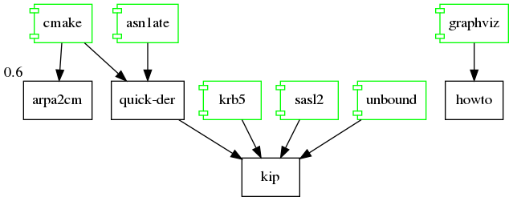

# The ARPA2 "HowTo" Files

> *This repository contains procedures and scripts that we like to use for
> all ARPA2 work, so it becomes a bit more consistent in how it works.*

 - [Buildsystem](buildsystem.md) information, on how we use CMake,
   and what a good top-level directory for an ARPA2 project looks like.
 - [Deliverables](deliverables.md) describes what kind of software
   artifacts come out of an ARPA2 project; in particular, how we
   use the CMake build inside of Docker.
 - [Merge](mastermerge.md) branching and merging policies and suggestions.
   Following consistent commit and merge practices makes the git logs
   across all ARPA2 projects easier to read.
 - [Releases](release.md) are done independently across different
   ARPA2 projects. In general newer releases lower down in the stack
   percolate upwards, triggering minor updates elsewhere.
 - [Packaging](packaging.md) of ARPA2 projects for Docker (our main
   delivery pipeline) and as native packages.

Additional procedural suggestions:

 - [blogging](blogging.md)
 - [porting](porting.md)
 - [testplatform](testplatform.md)
